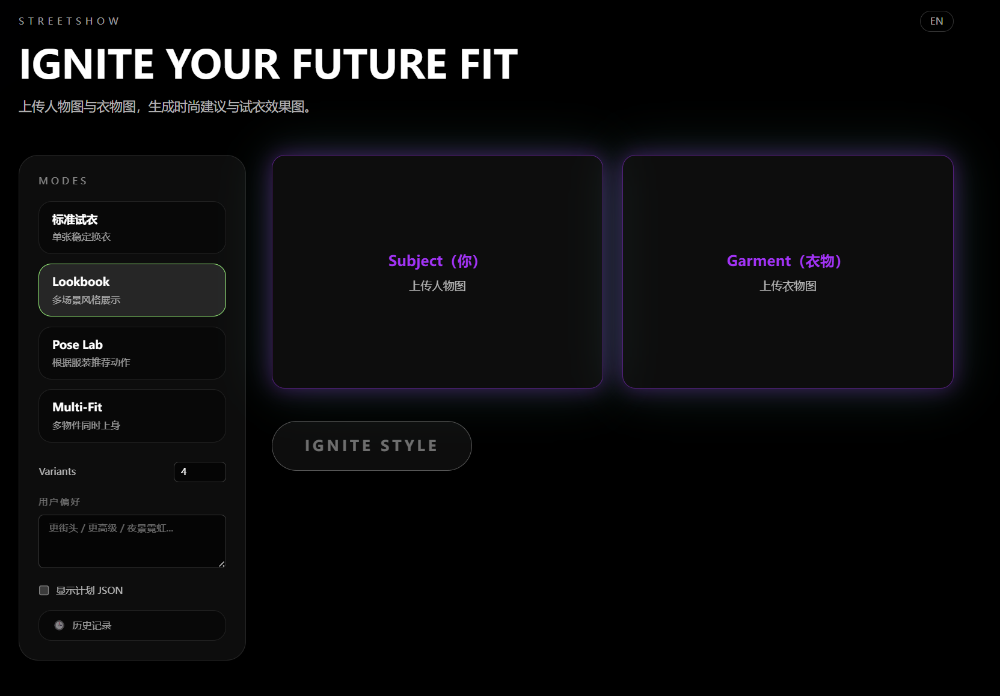
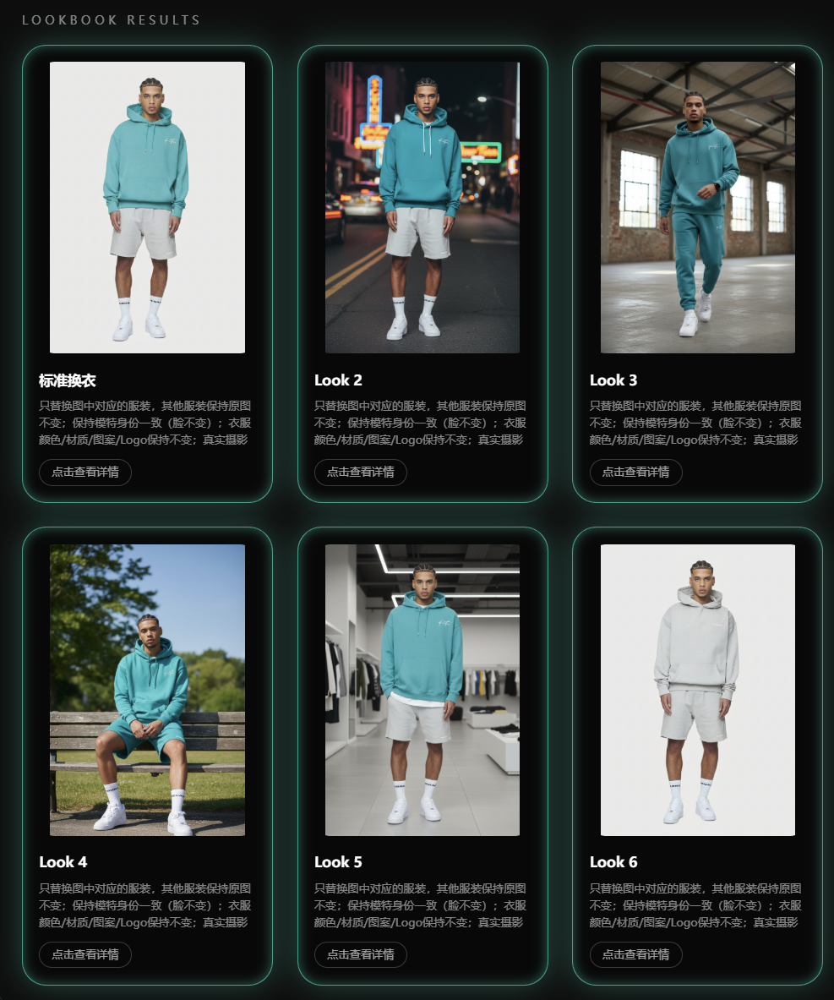
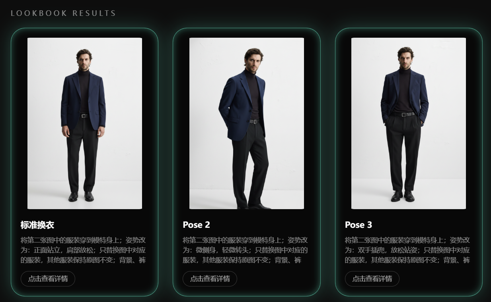
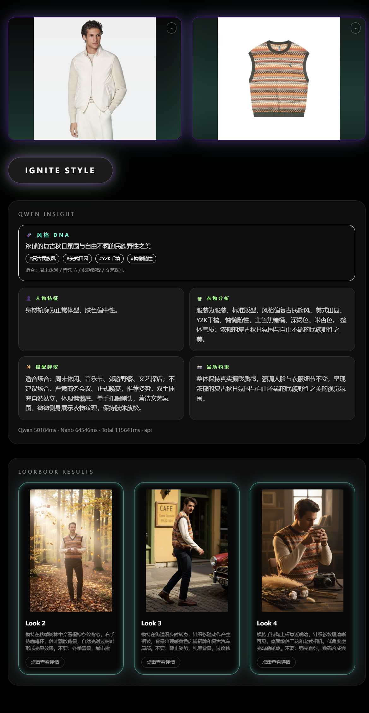
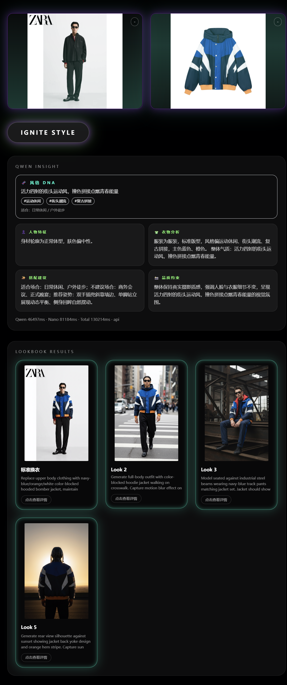
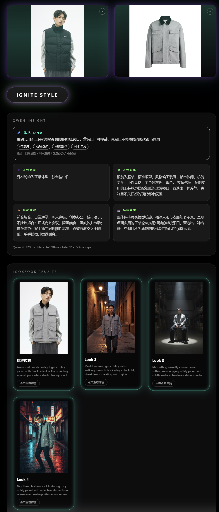
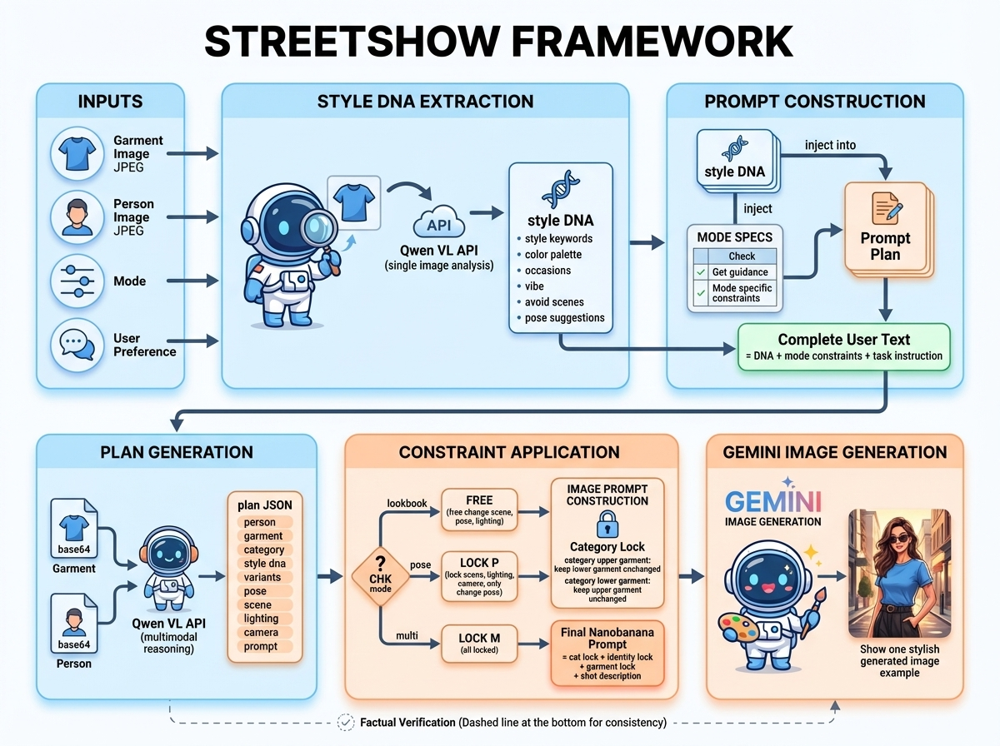

<div align="center">

**[中文](./README.md) | English**

# StreetShow

**AI-Powered Virtual Try-On & Intelligent Styling Consultant**

[](https://fastapi.tiangolo.com)
[](https://nextjs.org)
[](https://python.org)
[](LICENSE)



</div>

---

## Overview

**StreetShow** is a multimodal AI platform that combines virtual garment try-on with personalized style consulting. Upload a model photo and a garment image — the system analyzes the garment's style DNA, generates a structured shooting plan, and produces photorealistic try-on results across multiple fashion scenarios.

> Built by **StreetSenseLab**, HUST School of Artificial Intelligence.

### Key Capabilities

- **One-click try-on**: Automatically detects garment category (top / bottom / dress) and performs precise swap
- **Style DNA Extraction**: Deep analysis of fabric, silhouette, occasion fit, and visual vibe before generation
- **4 Shooting Modes**: Lookbook, Pose Lab, Multi-Fit, and Basic — each with distinct visual goals
- **Async Job Pipeline**: Long-running generation returns immediately with a job ID; frontend polls for completion
- **History Panel**: Compressed base64 storage keeps past sessions accessible without server-side URLs

---

## Demo

<div align="center">
  
  <p><em>Upload a garment → select Lookbook mode → multi-scene results generated</em></p>
</div>

### Lookbook — Multi-Scene Editorial

<div align="center">
  
</div>

### Pose Lab — Same Outfit, Different Poses

<div align="center">
  
</div>

### Multi-Fit — Simultaneous Top & Bottom Swap

<div align="center">
  
</div>

### More Results

<div align="center">
  
  
</div>

<div align="center">
  
</div>

---

## Architecture

```
┌─────────────────────────────────────────────────────────┐
│                     Next.js 14 Frontend                  │
│  /lookbook  /pose  /tryon  /basic  +  HistoryPanel       │
└───────────────────────┬─────────────────────────────────┘
                        │ HTTP / async polling
┌───────────────────────▼─────────────────────────────────┐
│                   FastAPI Backend                         │
│                                                           │
│  POST /api/process          (basic, sync)                 │
│  POST /api/process-advanced (multi-variant, sync)         │
│  POST /api/process-advanced-async + GET /jobs/{id}        │
│                                                           │
│  ┌─────────────────────────────────────────────────┐     │
│  │              Request Pipeline                    │     │
│  │  1. Image validation & JPEG normalization        │     │
│  │  2. analyze_garment_style()  ─► Style DNA JSON   │     │
│  │  3. build_qwen_plan()        ─► Shooting Plan    │     │
│  │  4. apply_mode_constraints() ─► Mode Locks       │     │
│  │  5. call_nanobanana_api()    ─► Try-on Image     │     │
│  └─────────────────────────────────────────────────┘     │
└───────────┬─────────────────────────┬───────────────────┘
            │                         │
   ┌────────▼────────┐      ┌────────▼────────┐
   │  DMXAPI         │      │  DMXAPI         │
   │  qwen3.5-flash  │      │  gemini-2.5-    │
   │  (Vision LLM)   │      │  flash-image    │
   │                 │      │  (Image Gen)    │
   └─────────────────┘      └─────────────────┘
```

<div align="center">
  
</div>

---

## Style DNA System

The core innovation of StreetShow is the **Style DNA** pipeline — garments are analyzed *before* any try-on prompt is constructed:

```
Garment Image
     │
     ▼
analyze_garment_style()          ← qwen3.5-flash, vision-only pass
     │
     ▼
{
  "style_keywords": ["oversized", "streetwear", "graphic"],
  "occasions":      ["casual", "skateboarding", "music festival"],
  "vibe":           "urban youth culture, relaxed confidence",
  "avoid_scenes":   ["formal office", "black-tie event"],
  "pose_suggestions": ["hands in pockets", "leaning on wall"],
  "color_palette":  ["off-white", "washed grey"]
}
     │
     ▼
build_qwen_plan()  ← injects DNA into scene/pose/lighting generation
     │
     ▼
Shooting Plan (k variants, each with unique scene/pose/lighting)
     │
     ▼
call_nanobanana_api() × k  ←  gemini-2.5-flash-image per variant
```

A **formal suit** yields studio + neutral tones; a **tie-dye hoodie** gets street backdrops and dynamic poses — no manual prompt engineering required.

---

## Quick Start

### Prerequisites

- Python 3.10+
- Node.js 18+
- A [DMXAPI](https://www.dmxapi.cn) key with access to `qwen3.5-flash` and `gemini-2.5-flash-image`

### Backend

```bash
git clone https://github.com/<your-username>/streetshow.git
cd streetshow

cp .env.example .env
# Edit .env: DMXAPI_KEY=your_key_here

pip install -r requirements.txt
uvicorn main:app --host 0.0.0.0 --port 8000 --reload
```

### Frontend

```bash
cd frontend
npm install
npm run dev
# → http://localhost:3000
```

### Verify

```bash
curl http://localhost:8000/health

curl -X POST http://localhost:8000/api/process \
  -F "person_image=@model.jpg" \
  -F "garment_image=@cloth.jpg"
```

---

## API Reference

### `POST /api/process`

| Field | Type | Description |
|-------|------|-------------|
| `person_image` | file | Model photo (JPEG/PNG, ≤10 MB) |
| `garment_image` | file | Garment photo |

### `POST /api/process-advanced`

| Field | Type | Default | Description |
|-------|------|---------|-------------|
| `mode` | string | `lookbook` | `lookbook` / `pose` / `tryon` |
| `k_variants` | int | `4` | Number of variants (1–6) |
| `user_prompt` | string | — | Optional style hint |

### `POST /api/process-advanced-async`
Returns immediately with `{"job_id": "..."}`. Poll at `GET /api/process-advanced/jobs/{job_id}`.

---

## Configuration

| Variable | Default | Notes |
|----------|---------|-------|
| `DMXAPI_KEY` | — | **Required** |
| `DMXAPI_VL_MODEL` | `qwen3.5-flash` | Vision analysis model |
| `DMXAPI_IMAGE_MODEL` | `gemini-2.5-flash-image` | Image generation model |
| `DMXAPI_TIMEOUT` | `90` | Per-request timeout (seconds) |
| `MAX_CONCURRENT` | `2` | Global semaphore limit |
| `MAX_UPLOAD_MB` | `10` | Upload size cap |
| `MAX_IMAGE_EDGE` | `2048` | Auto-resize threshold |
| `ASSET_TTL_SECONDS` | `3600` | Output image lifetime |

---

## Fault Tolerance

Three-tier JSON recovery when the vision model returns malformed output:

1. **Direct parse** — `json.loads()` on the raw response
2. **Block extraction** — regex to find `{...}` or code blocks
3. **Model repair** — send raw text back to Qwen to fix the format
4. **Randomized fallback** — `build_default_plan()` with `random.sample()` for diverse defaults

Image generation never crashes the server: `make_mock_image()` returns a gray placeholder when the API is unavailable.

---

## Tech Stack

| Layer | Technology |
|-------|-----------|
| Frontend | Next.js 14, TypeScript, Tailwind CSS |
| Backend | FastAPI, Python 3.10+, asyncio |
| Vision LLM | DMXAPI `qwen3.5-flash` (OpenAI-compatible) |
| Image Generation | DMXAPI `gemini-2.5-flash-image` |
| Image Processing | Pillow |
| Async Jobs | In-memory store with TTL |
| History | Browser localStorage + Canvas compression |

---

## License

MIT © 2025 StreetSenseLab, HUST School of Artificial Intelligence

---

<div align="center">

Made with ♥ at HUST · [Report Issues](https://github.com/<your-username>/streetshow/issues)

</div>
