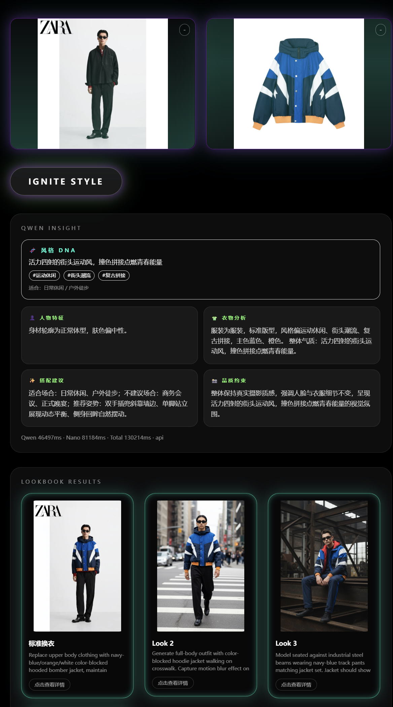
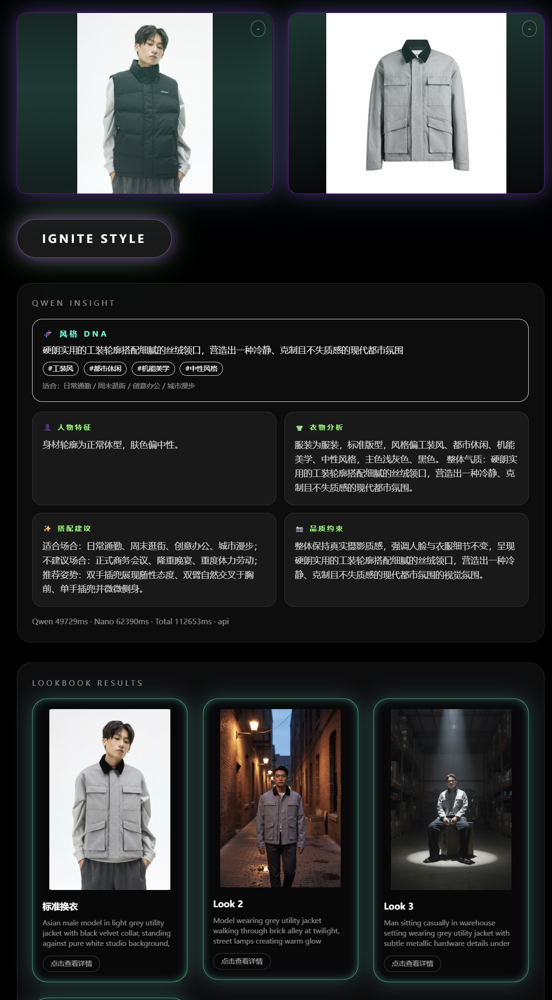

<div align="center">

**中文 | [English](./README.en.md)**

# StreetShow

**AI 驱动的虚拟试衣 & 智能造型顾问平台**

[](https://fastapi.tiangolo.com)
[](https://nextjs.org)
[](https://python.org)
[](LICENSE)


</div>

---

## 项目简介

**StreetShow** 是一个多模态 AI 平台，将虚拟服装试穿与个性化造型分析融合为一体。只需上传一张模特图和一张服装图，系统会自动提取服装风格 DNA，生成结构化的拍摄方案，并在多个时尚场景下输出真实感试衣效果图。

> 由**华中科技大学人工智能学院 StreetSenseLab** 开发。

### 核心能力

- **一键试衣**：自动识别服装类别（上装 / 下装 / 连衣裙），精准完成替换
- **风格 DNA 提取**：生成前深度分析面料、版型、场合适配性与整体气质
- **四种拍摄模式**：Lookbook、Pose Lab、Multi-Fit、标准试衣，各具独立视觉目标
- **异步任务流水线**：长耗时生成立即返回 job_id，前端轮询进度
- **历史记录面板**：Base64 压缩存储，历史结果不依赖服务端 URL 永久可访

---

## 效果展示

<div align="center">
  
  <p><em>操作演示：上传服装图 → 选择 Lookbook 模式 → 多场景结果生成</em></p>
</div>

### Lookbook — 多场景风格展示

<div align="center">
  
</div>

### Pose Lab — 同款服装，多种姿势

<div align="center">
  
</div>

### Multi-Fit — 上下装同时替换

<div align="center">
  
</div>

### 更多效果

<div align="center">
  
  
  
</div>


---

## 系统架构

```
┌─────────────────────────────────────────────────────────┐
│                  Next.js 14 前端                          │
│  /lookbook  /pose  /tryon  /basic  +  历史记录面板        │
└───────────────────────┬─────────────────────────────────┘
                        │ HTTP / 异步轮询
┌───────────────────────▼─────────────────────────────────┐
│                   FastAPI 后端                            │
│                                                           │
│  POST /api/process              （标准试衣，同步）         │
│  POST /api/process-advanced     （多方案，同步）           │
│  POST /api/process-advanced-async + GET /jobs/{id}        │
│                                                           │
│  ┌─────────────────────────────────────────────────┐     │
│  │              请求处理流水线                       │     │
│  │  1. 图片校验 & JPEG 标准化                       │     │
│  │  2. analyze_garment_style()  ──► 风格 DNA JSON  │     │
│  │  3. build_qwen_plan()        ──► 拍摄方案        │     │
│  │  4. apply_mode_constraints() ──► 模式锁定        │     │
│  │  5. call_nanobanana_api()    ──► 试衣效果图      │     │
│  └─────────────────────────────────────────────────┘     │
└───────────┬─────────────────────────┬───────────────────┘
            │                         │
   ┌────────▼────────┐      ┌────────▼────────┐
   │  DMXAPI         │      │  DMXAPI         │
   │  qwen3.5-flash  │      │  gemini-2.5-    │
   │  （视觉理解）    │      │  flash-image    │
   │                 │      │  （图像生成）    │
   └─────────────────┘      └─────────────────┘
```

<div align="center">
  
</div>

---

## 风格 DNA 系统

StreetShow 的核心创新在于**风格 DNA 流水线** —— 在生成试衣提示词之前，先对服装进行深度分析：

```
服装图片
  │
  ▼
analyze_garment_style()          ← qwen3.5-flash，仅视觉分析
  │
  ▼
{
  "style_keywords": ["oversized", "streetwear", "graphic"],
  "occasions":      ["日常休闲", "滑板", "音乐节"],
  "vibe":           "都市青年文化，慵懒自信",
  "avoid_scenes":   ["正式办公室", "黑领带场合"],
  "pose_suggestions": ["双手插兜", "倚墙而站"],
  "color_palette":  ["米白", "做旧灰"]
}
  │
  ▼
build_qwen_plan()  ← 将 DNA 注入场景/姿势/光影生成
  │
  ▼
拍摄方案（k 个方案，每个方案场景/姿势/光影各不相同）
  │
  ▼
call_nanobanana_api() × k  ← gemini-2.5-flash-image 逐方案生成
```

**效果**：正装西装自动匹配棚拍中性调；扎染卫衣自动生成街头背景与动感姿势 —— 无需用户手动写提示词。

---

## 快速开始

### 前置依赖

- Python 3.10+
- Node.js 18+
- [DMXAPI](https://www.dmxapi.cn) 密钥（需开通 `qwen3.5-flash` 和 `gemini-2.5-flash-image`）

### 后端启动

```bash
# 克隆仓库
git clone https://github.com/<your-username>/streetshow.git
cd streetshow

# 配置环境变量
cp .env.example .env
# 编辑 .env，填写：DMXAPI_KEY=你的密钥

# 安装依赖
pip install -r requirements.txt

# 启动后端（开发模式）
uvicorn main:app --host 0.0.0.0 --port 8000 --reload
```

### 前端启动

```bash
cd frontend
npm install
npm run dev
# → http://localhost:3000
```

### 验证

```bash
# 健康检查
curl http://localhost:8000/health

# 快速试衣测试
curl -X POST http://localhost:8000/api/process \
  -F "person_image=@model.jpg" \
  -F "garment_image=@cloth.jpg"
```

---

## 接口文档

### `POST /api/process`
标准单次试衣，同步返回 `advice` 文本 + `tryon_image_url`。

| 字段 | 类型 | 说明 |
|------|------|------|
| `person_image` | file | 模特图（JPEG/PNG，≤10 MB） |
| `garment_image` | file | 服装图 |

### `POST /api/process-advanced`
多方案试衣 + 结构化拍摄方案，额外参数：

| 字段 | 类型 | 默认值 | 说明 |
|------|------|--------|------|
| `mode` | string | `lookbook` | `lookbook` / `pose` / `tryon` |
| `k_variants` | int | `4` | 生成方案数（1–6） |
| `user_prompt` | string | — | 可选的用户风格偏好描述 |

### `POST /api/process-advanced-async`
同上，但立即返回 `{"job_id": "..."}`。  
通过 `GET /api/process-advanced/jobs/{job_id}` 轮询结果。

---

## 配置项

| 变量名 | 默认值 | 说明 |
|--------|--------|------|
| `DMXAPI_KEY` | — | **必填** |
| `DMXAPI_VL_MODEL` | `qwen3.5-flash` | 视觉分析模型 |
| `DMXAPI_IMAGE_MODEL` | `gemini-2.5-flash-image` | 图像生成模型 |
| `DMXAPI_TIMEOUT` | `90` | 单次请求超时（秒） |
| `MAX_CONCURRENT` | `2` | 全局并发信号量上限 |
| `MAX_UPLOAD_MB` | `10` | 上传图片大小上限 |
| `MAX_IMAGE_EDGE` | `2048` | 自动缩放阈值 |
| `ASSET_TTL_SECONDS` | `3600` | 输出图片生命周期 |

---

## 项目结构

```
streetshow/
├── main.py
├── backend/
│   ├── app.py
│   ├── core/
│   │   ├── config.py
│   │   ├── model.py
│   │   └── state.py
│   ├── routers/
│   │   ├── process.py
│   │   └── process_advanced.py
│   └── services/
│       ├── qwen.py            # 视觉分析 + 方案生成
│       ├── plan_modes.py      # 模式规格 + 提示词构建
│       ├── nanobanana.py      # Gemini 图像生成
│       ├── advice.py          # 建议卡片构建
│       └── job_store.py       # 异步任务注册表
├── frontend/
│   ├── app/
│   │   ├── lookbook/page.tsx
│   │   ├── pose/page.tsx
│   │   ├── tryon/page.tsx
│   │   └── basic/page.tsx
│   └── components/
│       ├── ModePage.tsx
│       └── HistoryPanel.tsx
├── gemini_draw.py
├── requirements.txt
└── .env.example
```

---

## 容错机制

StreetShow 针对视觉模型输出不稳定问题设计了**三级 JSON 恢复**策略：

1. **直接解析** — `json.loads()` 解析原始输出
2. **块提取** — 正则匹配 `{...}` 或代码块
3. **模型修复** — 将原始文本发回 Qwen 请其修正格式
4. **随机化兜底** — `build_default_plan()` 用 `random.sample()` 生成多样性兜底方案

图像生成失败时，`make_mock_image()` 返回灰色占位图，服务不崩溃。

---

## 技术栈

| 层级 | 技术 |
|------|------|
| 前端 | Next.js 14、TypeScript、Tailwind CSS |
| 后端 | FastAPI、Python 3.10+、asyncio |
| 视觉理解 | DMXAPI `qwen3.5-flash`（OpenAI 兼容接口） |
| 图像生成 | DMXAPI `gemini-2.5-flash-image` |
| 图像处理 | Pillow |
| 异步任务 | 内存 KV 存储 + TTL 清理 |
| 历史持久化 | 浏览器 localStorage + Canvas 压缩 |

---

## 开源协议

MIT © 2025 StreetSenseLab，华中科技大学人工智能学院

---

<div align="center">

用 ♥ 在华科制作 · [提交问题](https://github.com/<your-username>/streetshow/issues)

</div>
